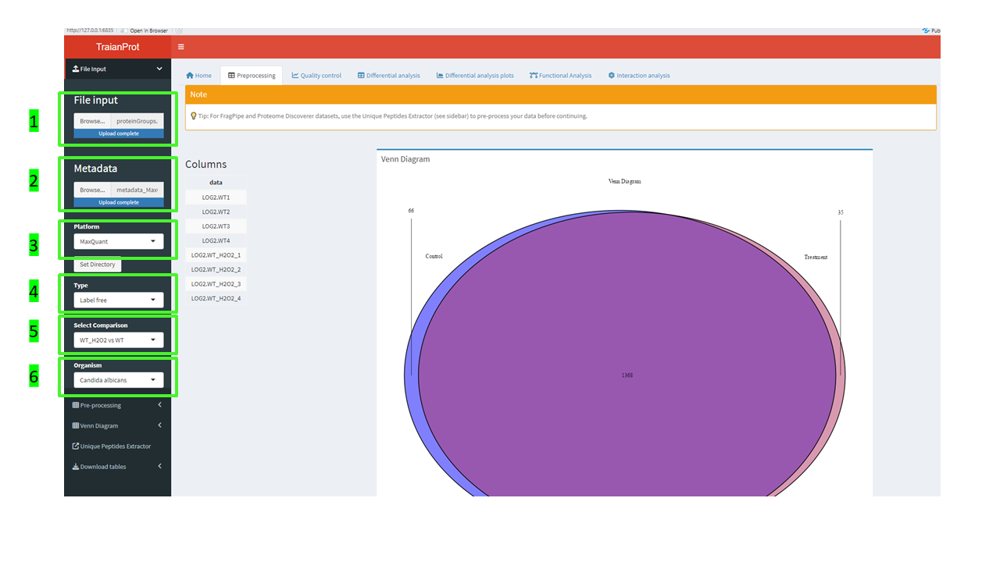
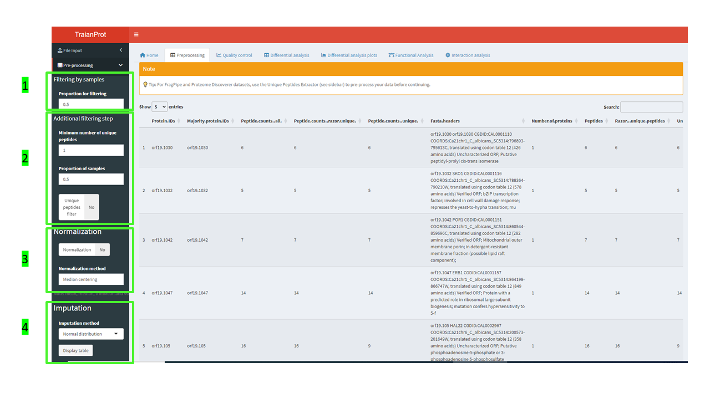
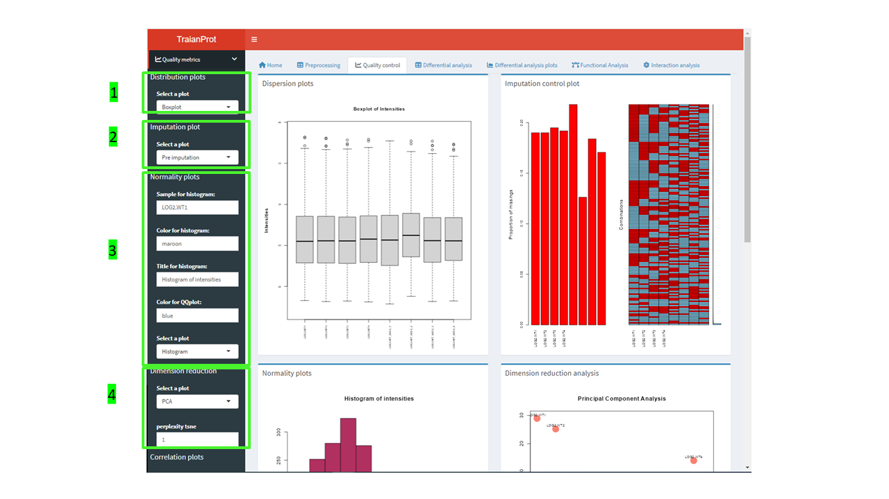
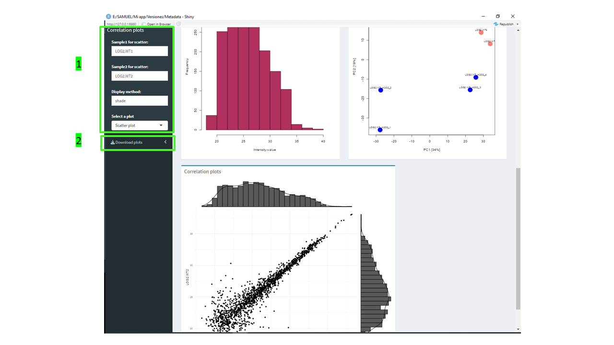
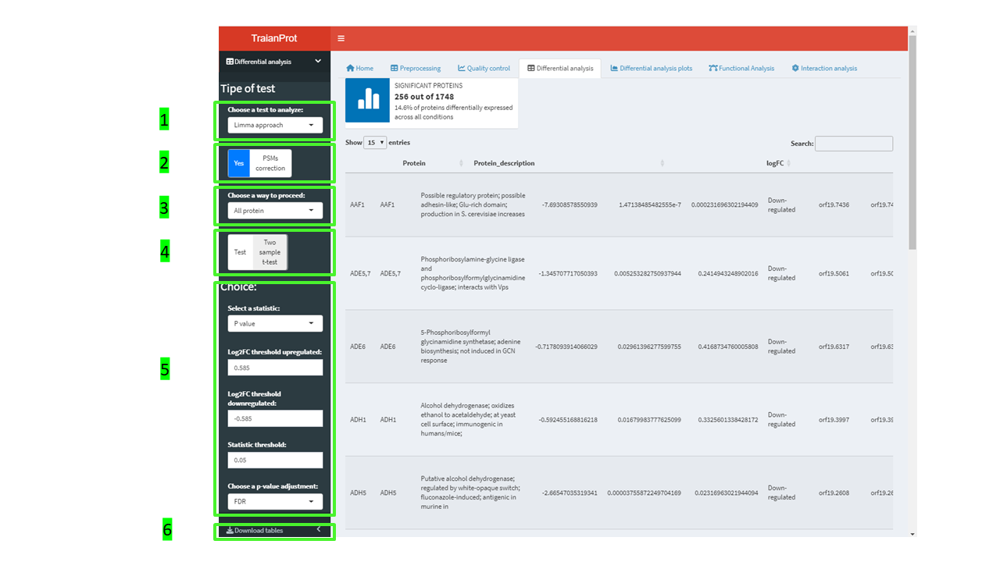
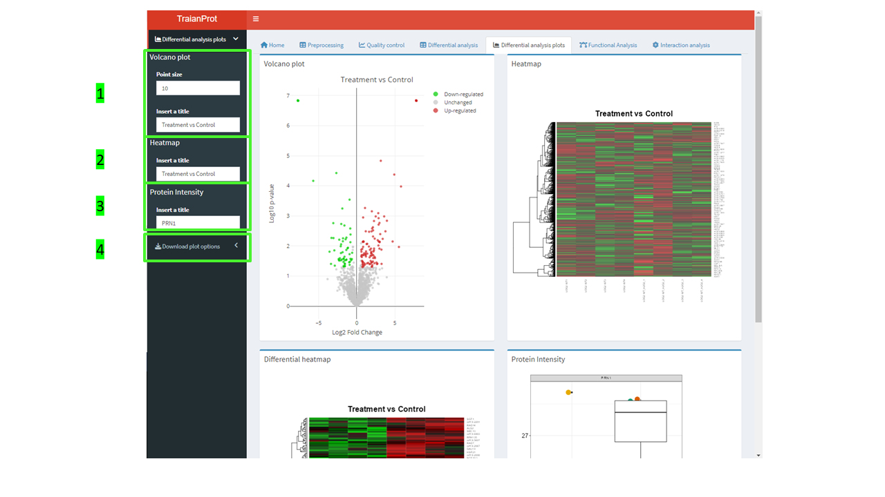
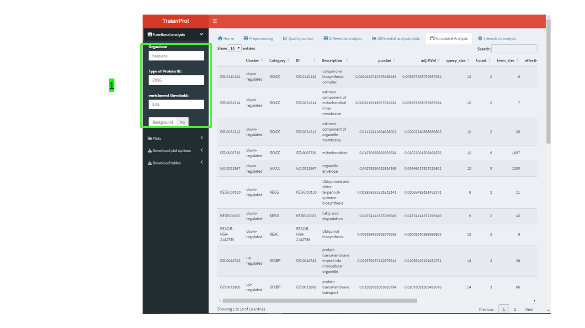
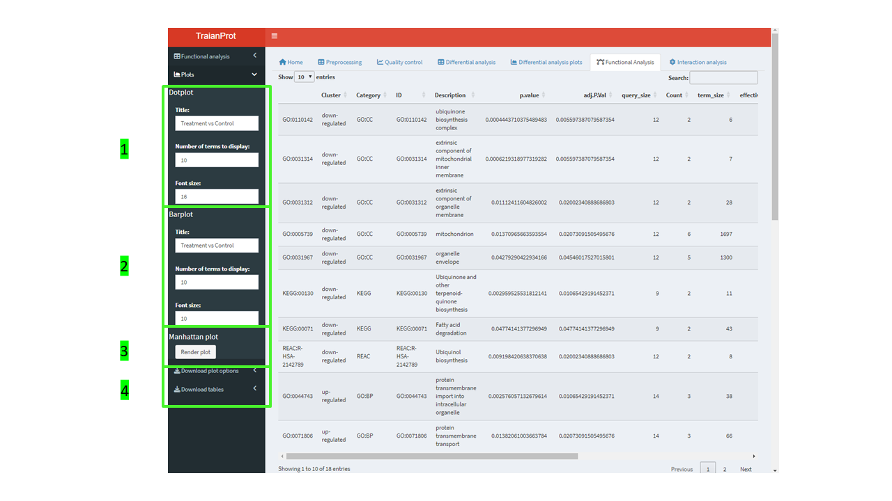
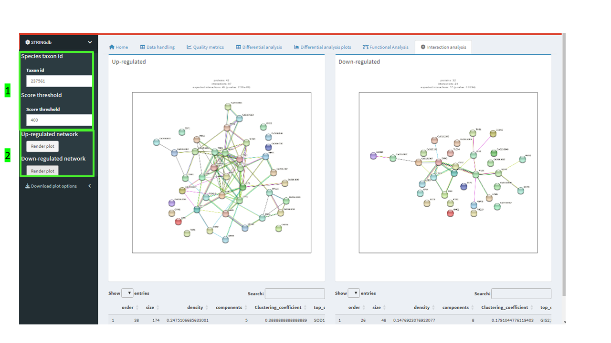

```{r, include = FALSE}
knitr::opts_chunk$set(
  collapse = TRUE,
  comment = "#>"
)
```

# 1. Introduction

**TraianProt** is an interactive R/Shiny package designed to simplify the downstream analysis of wide-format proteomics data.  
It provides a modular workflow for processing both **label-free** and **labeled** quantitative data obtained from **Data-Dependent Acquisition (DDA)** or **Data-Independent Acquisition (DIA)** mass spectrometry experiments.

Supported input formats include output from tools such as **MaxQuant**, **MSFragger**, **DIA-NN**, **ProteoScape**, and **Proteome Discoverer**.


## Key Features

- 🔹 Intuitive user interface built on **Shiny**  
- 🔹 Flexible data input compatible with common proteomics pipelines  
- 🔹 Integrated normalization and filtering procedures  
- 🔹 Robust differential analysis and visualization tools  
- 🔹 Functional enrichment and **PPI network** exploration  

> 💡 *This vignette provides a step-by-step walkthrough of the TraianProt workflow — from data import to biological interpretation.*


# 2. Data Preparation

Before starting, ensure your data file is formatted appropriately (e.g., protein groups table and metadata table).  
Each column should correspond to a **sample** , and rows should represent **proteins**.
The following code chunck includes the example format for MaxQuant output data and the metadata format which is globally shared among all search engines supported. 

```{r, eval=FALSE}
# Example: Reading example dataset
example_data <- read.delim("proteinGroups.txt", sep = "\t", stringsAsFactors = FALSE, colClasses = "character", check.names = FALSE) 

metadata <- read.delim("metadata_MaxQuant.tsv", sep = "\t", stringsAsFactors = FALSE, colClasses = "character", check.names = FALSE) 

head(example_data)
```

> ⚠️ *Tip: Missing values can occur frequently in proteomics data — TraianProt offers integrated imputation tools to handle these gracefully.*


# 3. Using the Application

Launch the Shiny interface by running:

```{r, eval=FALSE}
library(TraianProt)
runTraianProt()
```

Once launched, the main interface presents a **modular workflow**, allowing you to perform each analysis step sequentially.


# 4. Core Modules Overview

TraianProt provides a comprehensive suite of analytical modules:

### 4.1 Preprocessing
If no dataset has been processed a new dataset can be uploaded in the file input buton (Figure 1, Point 1). Users should remember that outputs from MaxQuant, MSFragger, DIA-NN, Proteome Discoverer and ProteoScape are supported, so once it has been uploaded the format has to be selected (Figure 1, Point 3). A metadata file is also required, and it can be uploaded in the metadata button (Figure 1, Point 2).

Whether data is Label free, SILAC or TMT needs to be specified in the type button (Figure 1, Point 4). Once both the dataset and the metadata have been uploaded, the conditions to be compared must be selected. To do this, click the 'Select Comparison' button (Figure 1, Point 5) to view all the options and select the desired ones.
Finally, the user will choose between “Candida albicans” or “other” for the database used (Figure 1, Point 6), this is because the Candida Genome Database has a special structure, which differs to the ones in UniProt (in this case other should be selected).

```{r, echo=FALSE, out.width="100%", fig.cap="Figure 1: Preprocessing module; data upload."}

```

Once the data has been uploaded the user is asked whether to filter for missing values (Figure 2, Point 1), during log transformation these will be assigned as NA being considered as non-valid. The additional filtering step (Figure 2, Point 2) is referred to the unique peptides filter. The users can filter out the dataset according to the number of unique peptides identified per protein established in “Minimun number of unique peptides” in a certain proportion of samples. P. e as it is displayed in Figure 2, Point 2 proteins with one unique peptide in at least 50% of the samples in at least one of the two conditions compared will be kept for further analysis.
The normalization of the samples included in the conditions we are evaluating can be assessed by clicking the normalization button in (Figure 2, Point 3). The different normalization methods are mean, median centering, trimMean and vsc. They will be applied through writing in the “Normalization method” prompt.

Finally, the imputation choice can be assessed (Figure 2, Point 4). The users can choose between “No imputation”, “Normal distribution” which commits the imputation considering a normal distribution and “K Nearest Neighbors” which uses the KNN algorithm for imputing.

```{r, echo=FALSE, out.width="100%", fig.cap="Figure 2: Preprocessing module; data preprocessing."}

```

### 4.2 Quality Control

This module covers a group of plots that describe the nature of our data (distribution, dispersion, missing values proportion in our data) Inside this section we can highlight the following setions:
• Distribution plots: include a boxplot and dispersion plot (Figure 3, Point 1).
• Imputation plots: include a representation of the amount of missing values in the data before imputation and overly of both imputed and non-imputed distribution in data (Figure 3, Point 2). It is necessary to point out that the “Post imputation” plot only works if the imputation option has been enabled.
• Normality plots: covers a set of plots whose purpose is to the representation of data´s distribution, including histogram of proteins abundances and a Q-Q plot. It is necessary to point out that It will only work if the name of the sample is introduced in the prompt (as they are displayed in the preprocessing module).
• Dimension reduction plots: plot with Principal Component Analysis or t-SNE (Figure 3, Point 4) in case t-SNE is displayed a perplexity parameter can be applied, taking as the maximum value N/2, being N the number of samples per condition.
• Correlation plots: include a Scater plot and correlation plot. Sample names must be entered via the prompt for both plots to display (Figure 4, Point 1).

```{r, echo=FALSE, out.width="100%", fig.cap="Figure 3: Quality control module."}

```
All the previous plots can be downloaded in a paper ready format (tiff) or in .png, .jpeg or .pdf (Figure 4, Point 2).

```{r, echo=FALSE, out.width="100%", fig.cap="Figure 4: Quality control download choices."}

```

### 4.3 Statistical Analysis
In the differential analysis module, the user has the ability of performing statistical tests. Firstly, the statistical test to analyze data is required to be chosen. The “Simple t test approach” option performs two sample t-tests on protein intensity data using the t test function from base R. The “Limma approach” option uses limma (v 3.64.3) R package to calculate significant differences between groups. Later but not least the “Wilcoxon test” option, represents a non-parametric alternative which can be used to compare two independent groups of samples, used when the data is not normally distributed. These options are displayed in Figure 5, Point 1. Only if the “Limma approach” is selected a variance correction depending on the number of PSMs identified can be applied (Figure 5, Point 2) performed using the DEqMS (v1.26.0) R package.

In Figure 5, Point 3 users can choose whether to keep the Unique proteins in the final dataset as significant proteins or not. When “All protein” is selected, the unique proteins will be included in the final dataset, obtaining the maximum value of log2FC for those who were exclusively identified in the “Treatment” condition, along with the smallest value of p-value and adjusted p-value and obtaining the minimum value of log2FC for those who were exclusively identified in the “Control” condition, along with the smallest value of p-value and adjusted p-value. This is done with the aim of keeping track of unique proteins. Moreover, whether the comparison is dependent or independent two sample t test can be specified (Figure 5, Point 4)

In Figure 5, Point 5 the user can select between P value or adjusted p value for the statistical cut-off whose value is established in the “Statistic threshold” prompt and the method selected for commiting the p-value adjustment is specified in the “Choose a p-value adjustment” prompt. Furthermore, the Log2FC threshold can be assigned.
Finally, the data table can be downloaded as it is displayed in Figure 5, Point 6.

```{r, echo=FALSE, out.width="100%", fig.cap="Figure 5: Statistical analysis module."}

```

### 4.4 Differential Analysis plots module

In this module 3 different types of plots are included; the first one is the volcano plot which enables the visualization of data within an experimental setup and how each comparison differs to another, users can specify the points size and the title (Figure 6, Point 1). In addition, in this module two heatmaps are displayed, the first one displays the identified proteins and the second one those proteins that exhibited differential relative abundances, users can write the title for the plot (Figure 6, Point 2). Finally, there is a Protein intensity plot which displays log2 Intensity of a protein across the samples of every condition, the Protein id (which appears in the Protein column) needs to be entered in the “Insert a title prompt) Figure 6, point 3. All the plots can be downloaded through the “Download plot options” (Figure 6, Point 4).

```{r, echo=FALSE, out.width="100%", fig.cap="Figure 6: Statistical analysis plots."}

```

### 4.5 Functional Analysis module
The functional analysis module is focused on performing gene set enrichment analysis taking into consideration those proteins that exhibited significant changes in their relative abundance and it is performed using the gprofiler2 (v0.2.3) R package. For that purpose, users have to introduce the organism id, for example in case we are analyzing C. albicans derived mass spectrometry data, “calbicans” should be introduced (obtained from htps://biit.cs.ut.ee/gprofiler/page/organism-list) the type of Protein ID which serves as the nomenclature destination change for the protein ids (it is always ENSG as default), the enrichment threshold for the retrieval of functional terms and whether the whole list of identified proteins is used as the background (this op􀆟on is recommended to set as “YES” as it is going to allow to obtain unbiased results).
All the parameters are shown in Figure 7, Point 1.

```{r, echo=FALSE, out.width="100%", fig.cap="Figure 7: Functional analysis module."}

```

In the plot section, the user has the ability of customizing both a Dotplot and a Barplot, by adding the title name, the number of terms to display and the corresponding size of the font used (Figure 8, Points 1 and 2). Furthermore, a Manhatan plot can be displayed as the “Render plot” button is clicked in Figure 9, Point 3. Both the plots and the data table containing the functional terms can be download in the “Download plots” and “Download table” section respectively (Figure 8, Point 4).

```{r, echo=FALSE, out.width="100%", fig.cap="Figure 8: Functional analysis plots."}

```

### 4.6 Protein-Protein Interaction module
In the interaction analysis module, the user is allowed to perform a protein interaction analysis with the proteins that exhibited significant changes in their relative abundance using the STRINGdb (v2.20) R package. For that purpose, in Figure 9, Point 1 the user is required to introduce the STRING ID for the species along with a score threshold. Finally, the network shown can be downloaded (Figure 9, Point 2).


```{r, echo=FALSE, out.width="100%", fig.cap="Figure 9: Protein-Protein Interaction module."}

```

# 5. Session Information

For reproducibility, include session information:

```{r}
sessionInfo()
```


# 6. Summary

**TraianProt** streamlines the analysis of proteomics datasets within an intuitive graphical interface.  
From normalization to enrichment analysis, it supports a complete and reproducible workflow.

> 🎯 *Whether you are a beginner or experienced researcher, TraianProt provides a fast and transparent way to extract biological insights from quantitative proteomics data.*
